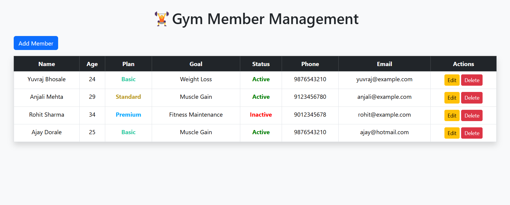
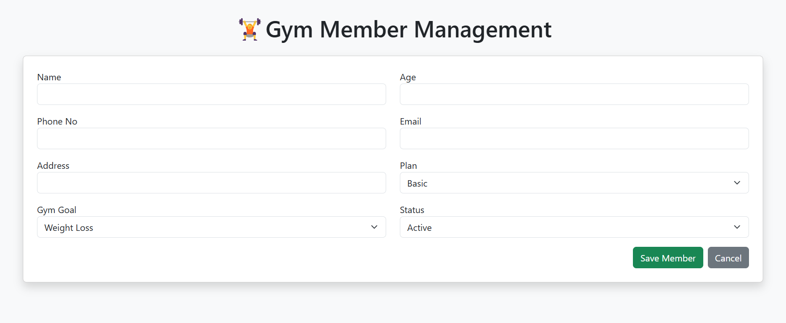
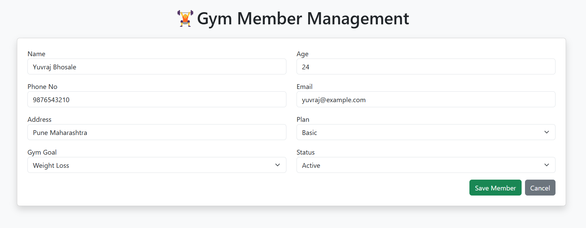
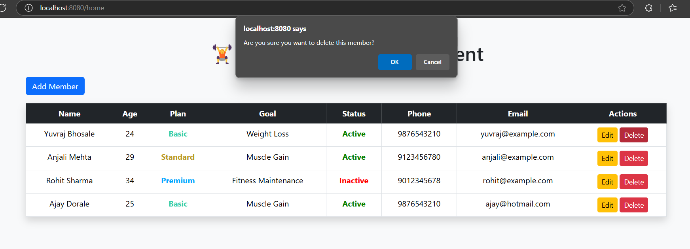

# 🏋️ Gym Management System

A sleek, full-stack Gym Management System built using **Spring Boot (Java)** with a frontend in (**HTML**, **CSS**, **JavaScript**) — enabling smooth **CRUD operations** via REST APIs and a user-friendly interface.

> Designed for simplicity, performance, and extendability — ideal for learning and real-world use cases.

---

## ✨ Features

- 🔄 **Full CRUD support** for managing gym members
- 🧰 Built with **Spring Boot** and **RESTful APIs**
- ⚡ Fast and lightweight with **H2 in-memory database**
- 🌐 Frontend styled with clean, modern UI using HTML/CSS/JS
- 📊 View, edit, and manage member data in real-time
- 📦 Easy to run locally — no external database setup needed

---

## 🛠️ Tech Stack

| Layer      | Technology           |
|------------|----------------------|
| Backend    | Spring Boot, Java    |
| Database   | H2 (In-Memory)       |
| Frontend   | HTML, CSS, JavaScript |
| API Style  | RESTful              |
| Build Tool | Maven                |

---

💡 Future Improvements
✅ User login & authentication
✅ Membership plans and payments
✅ Dashboard with analytics
✅ Responsive mobile design

## 🚀 Getting Started
### 1️⃣ Clone the Repository
```bash
git clone https://github.com/your-username/gym-management-system.git
cd gym-management-system

2️⃣ Run the Application
You can use an IDE (like IntelliJ/VS Code) or run from terminal:
./mvnw spring-boot:run

Make sure Java 17+ and Maven are installed.

3️⃣ Open the App
## 📸 UI Preview







🗄️ H2 Console
JDBC URL: jdbc:h2:mem:testdb
Username: yuvraj
Password: null


Project Structure:
📁gym-management-system/
├── src/
│   ├── main/
│   │   ├── java/
│   │   │   └── com.example.gym/
│   │   │       ├── controller/
│   │   │       ├── model/
│   │   │       ├── repository/
│   │   │       └── GymManagementApplication.java
│   │   └── resources/
│   │       ├── static/index.html         #Frontend in HTML, CSS, JS
│   │       ├── application.properties
│   │       └── data.sql
├── README.md
├── pom.xml


API Endpoints Documentation
1. Create Member
Endpoint: POST http://localhost:8080/members/add
Description: Adds new member.
Request Body:
{
        "name": "Pritam Surwase",
        "age": 25,
        "plan": {
            "planId": 2,
            "planName": "Standard",
            "planPrice": 1200,
            "planDuration": "3 Months"
        },
        "gymGoal": {
            "goalId": 2,
            "goalType": "Muscle Gain"
        },
        "status": true,
        "phoneno": 9123456780,
        "email": "pritam@example.com",
        "address": "Pune Maharashtra"
}

2. Display the Members
Endpoint: GET- http://localhost:8080/member/
Description: Retrieves a members from db.
Response Body:
[
    {
        "id": 1,
        "name": "Yuvraj Bhosale",
        "age": 24,
        "plan": {
            "planId": 1,
            "planName": "Basic",
            "planPrice": 500,
            "planDuration": "1 Month"
        },
        "gymGoal": {
            "goalId": 1,
            "goalType": "Weight Loss"
        },
        "status": true,
        "phoneno": 9876543210,
        "email": "yuvraj@example.com",
        "address": "Pune Maharashtra"
    },
    {
        "id": 2,
        "name": "Anjali Mehta",
        "age": 29,
        "plan": {
            "planId": 2,
            "planName": "Standard",
            "planPrice": 1200,
            "planDuration": "3 Months"
        },
        "gymGoal": {
            "goalId": 2,
            "goalType": "Muscle Gain"
        },
        "status": true,
        "phoneno": 9123456780,
        "email": "anjali@example.com",
        "address": "Mumbai Maharashtra"
    },
    {
        "id": 3,
        "name": "Rohit Sharma",
        "age": 34,
        "plan": {
            "planId": 3,
            "planName": "Premium",
            "planPrice": 4000,
            "planDuration": "1 Year"
        },
        "gymGoal": {
            "goalId": 3,
            "goalType": "Fitness Maintenance"
        },
        "status": false,
        "phoneno": 9012345678,
        "email": "rohit@example.com",
        "address": "Delhi India"
    },
    {
        "id": 4,
        "name": "Ajay Dorale",
        "age": 25,
        "plan": {
            "planId": 1,
            "planName": "Basic",
            "planPrice": 500,
            "planDuration": "1 Month"
        },
        "gymGoal": {
            "goalId": 2,
            "goalType": "Muscle Gain"
        },
        "status": true,
        "phoneno": 9876543210,
        "email": "ajay@hotmail.com",
        "address": "Pune Maharashtra"
    },
    {
        "id": 5,
        "name": "Pritam Surwase",
        "age": 25,
        "plan": {
            "planId": 2,
            "planName": "Standard",
            "planPrice": 1200,
            "planDuration": "3 Months"
        },
        "gymGoal": {
            "goalId": 2,
            "goalType": "Muscle Gain"
        },
        "status": true,
        "phoneno": 9123456780,
        "email": "pritam@example.com",
        "address": "Pune Maharashtra"
    }
]


4. Update Member
Endpoint: PUT- http://localhost:8080/members/update/{id}
Description: Updates the details of a member.
Request Body:
{
    "id": 1,
    "name": "Yuvraj Bhosale",
    "age": 24,
    "plan": {
        "planId": 1,
        "planName": "Basic",
        "planPrice": 500,
        "planDuration": "1 Month"
    },
    "gymGoal": {
        "goalId": 1,
        "goalType": "Weight Loss"
    },
    "status": true,
    "phoneno": 9876543210,
    "email": "yuvraj@example.com",
    "address": "Pune Maharashtra"
}
Response Body:
"Member details updated successfully."

5. Delete Member
Endpoint: DELETE- http://localhost:8080/members/delete/{id}
Description: Deletes a member by its ID.
Response Body:
{
  "message": "Task deleted successfully"
}
